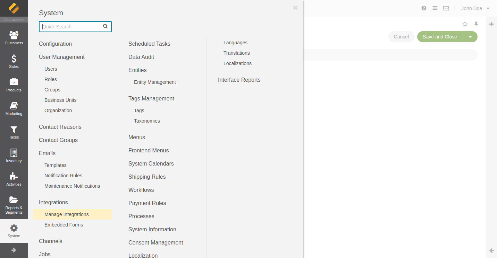
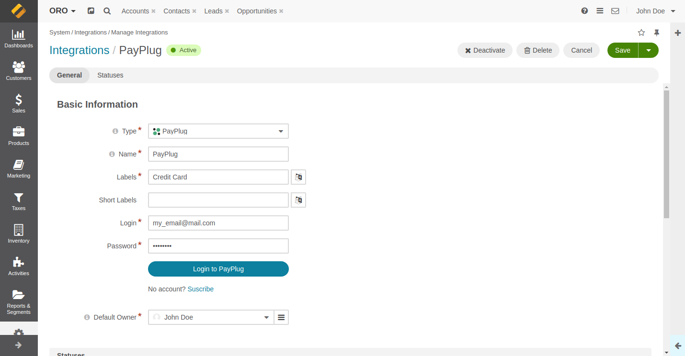
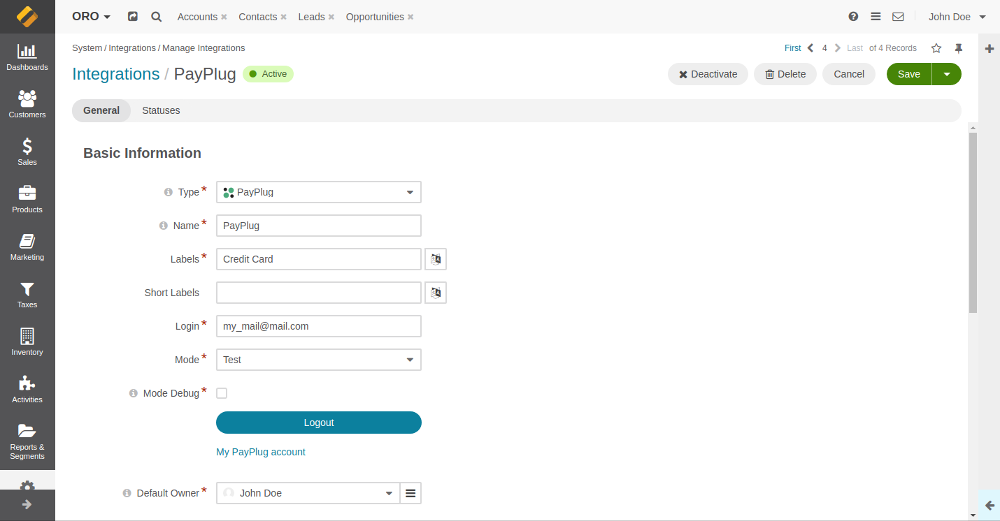
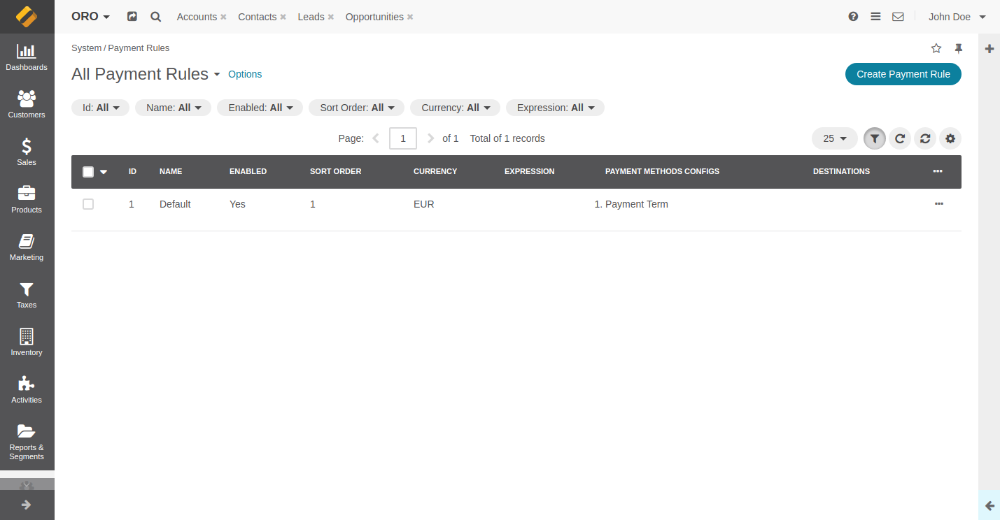
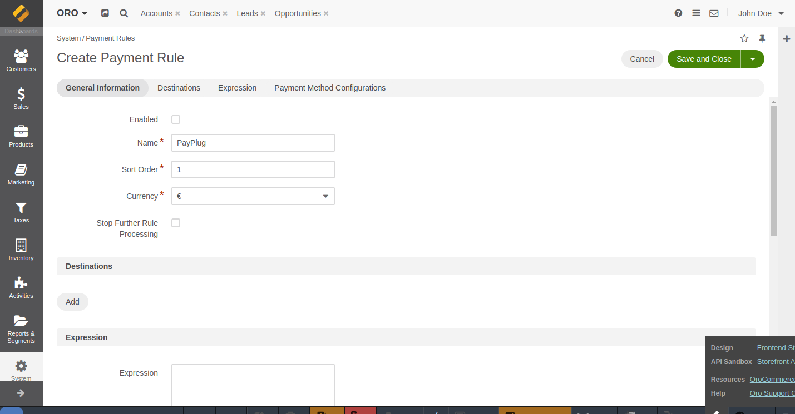
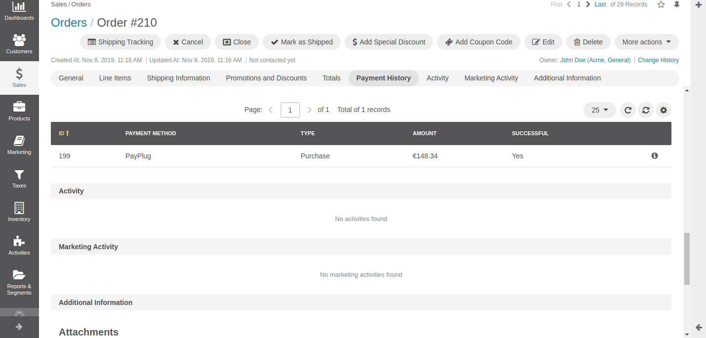
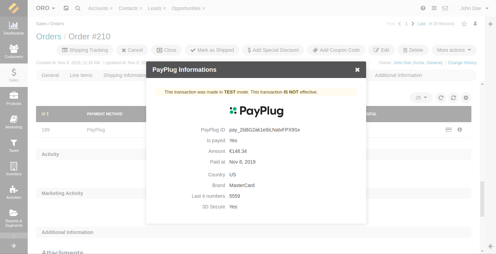
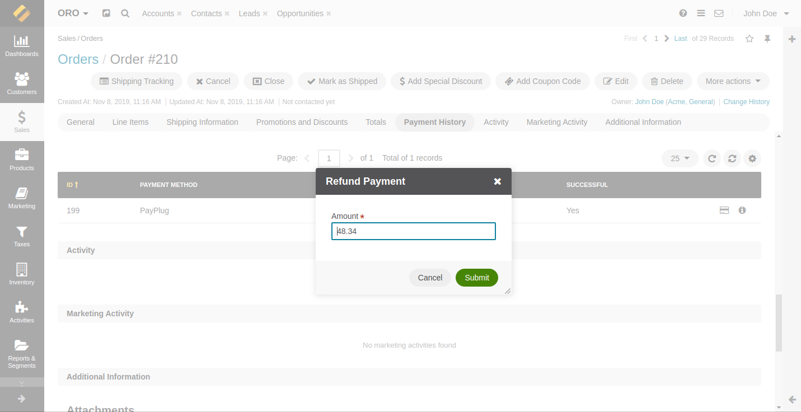
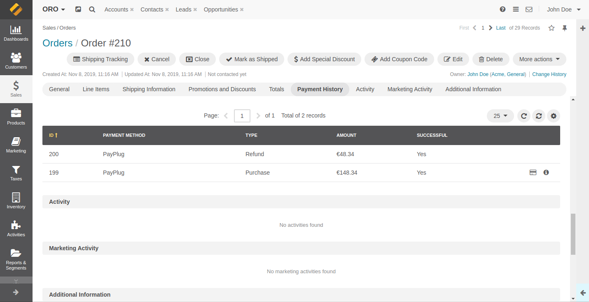

# How to install and configure the PayPlug module for OroCommerce 4.1

## 1 - Module installation
The installation is exclusively done using the OroCommerce application console.

To start the installation, browse to your project's root folder and update the application's composer.lock.
To do so, install the module using composer with the following command :

```sh
composer require payplug/payplug-orocommerce --prefer-dist --update-no-dev
```

Remove cache directory with this command:

```sh
sudo rm -rf var/cache/prod
```

To complete the installation, execute the following command:

```sh
php bin/console oro:platform:update --force --timeout=0 --skip-translations --skip-download-translations --skip-search-reindexation --env=prod
```

Finally, make sure to properly clean the cache:

```sh
php bin/console cache:clear --env=prod
```

## 2 - Module configuration
Configuring the module is done through 4 steps.

### 2.1 - Create the integration
You have to create an integration to activate the payment method.
Open the System menu on the left or top of your screen (depending on the position of the menu in your back office), then open "Manage Integrations"



On the integration page, create a new integration using the button "Create integration"


Fill out the mandatory information :
* Name : The name of your module. This name will only be used in your back office but won't be displayed to your customers.
* Label : The name displayed to your customers. It can be translated in every languages of your OroCommerce instance.
* Login : Your PayPlug account e-mail.

Save the form to display the password field and the "Login to PayPlug" button

### 2.2 - Connect the module to your PayPlug account
The second step is necessary to connect the PayPlug module to your PayPlug environment and activate the module in your shop.



Fill in your login and password in the dedicated fields then click on "Connect". Upon success, your API keys are passed to the module.

### 2.3 - TEST and LIVE modes
Once connected, you can decide between 2 modes :
* TEST mode : Payments and refunds will be faked for testing purposes.
* LIVE mode : Payments and refunds will be processed. This is the mode that you should use in production.



The debug mode allows for more information to be recorded to the application logs.

### 2.4 - Create a payment rule
This final step will let you define when to display the payment method in your shop. You can access to Payment Rules
configuration from the main menu: System > Payment Rules





When you create your payment rule, you should define :
* If your rule should be activated or not. To enable the payment rule, open the "All payment rules" page, click on the "..." icon and use the "check" icon.
* The name of your payment rule (will only be displayed in the administration panel)
* The order in which your rule should be placed compared to your other rules (1, 2, 3, 11, 23, ...)
* The currency associated with the rule. Only EURO can be selected for PayPlug payment integration.
* Payment method configuration by adding PayPlug integration.


You can also (optional):
* Tick "Stop Further Rule Processing", in which case the rules that should apply will not.
[Documentation](https://oroinc.com/b2b-ecommerce/doc/1.6/admin-guide/payment/payment-rules)
* Fill in the "Destination" and choose an associated target : Country, State/Region, Zip code ...
* Define a regular expression to filter the elements on which the rule should be applied.
[Documentation](https://oroinc.com/b2b-ecommerce/doc/current/admin-guide/shipping/shipping-rules/expression-lang)

## 3 - Information about payments
You can obtain more information on a payment processed with PayPlug by clicking on the "Information" button on the payment line in the order recap.





## 4 - Refund
The refund feature is available in the order recap. You can refund part or the total amount of a payment by typing in the corresponding amount.



Once the refund processed, a new line is added to the recap showing the refund.



## 5 - Logging out of the Module
You can log your module out of PayPlug using the "edit integration" feature.


Logging out will disable :
* The payment method on your shop, it won't be visible to customers anymore
* The retrieval of payment information
* The refund of an already processed payment

